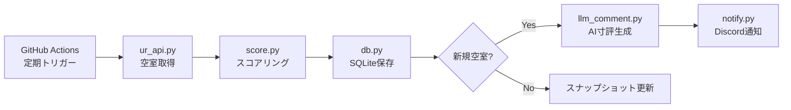
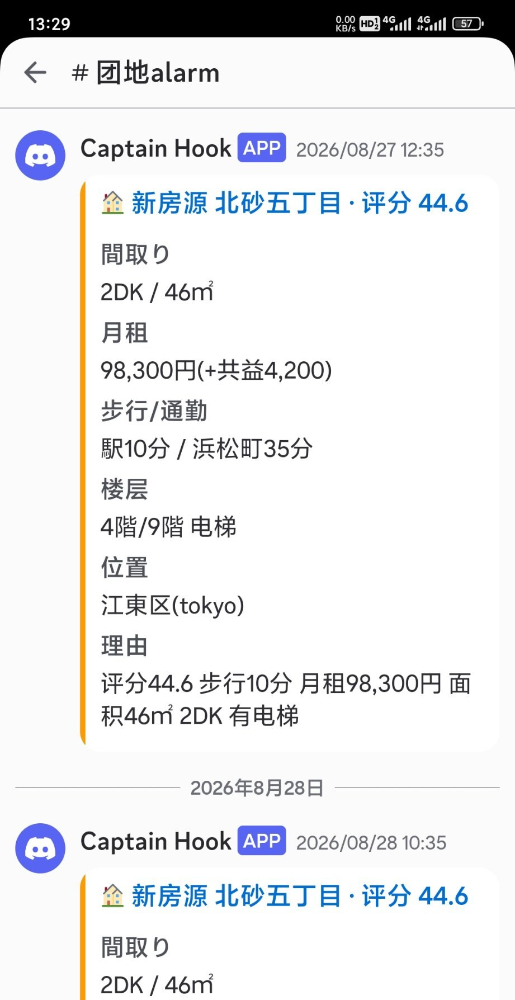

# UR団地 新空房监控

> UR賃貸の新着空室を自動監視し、スコアリングして Discord に通知するシステム。GitHub Actions で定期実行中。
> A fully automated UR-housing vacancy monitor: scheduled polling, scoring, and Discord push notifications via GitHub Actions.
> 🤖 **AI 辅助开发（AI-assisted development）**——架构设计与关键决策由作者完成。

## プロジェクト概要

- **課題**: 東京圏 UR賃貸の空室は先着順で、良い部屋はすぐ埋まる。手動チェックでは見逃す。
- **解決**: GitHub Actions で定期ポーリング → 新空室を検出 → 通勤時間・家賃・間取りでスコアリング → Discord にプッシュ通知。LLM が部屋の寸評も生成（`llm_comment.py`）。
- **工夫**: スナップショット diff で差分のみ通知、403/429 時の指数バックオフ＋ランダムジッターでブロック回避、SQLite に輪询履歴を蓄積。

## アーキテクチャ



## 運行効果

実際の Discord 通知（2026年8月）：



---

监控东京圈 UR賃貸住宅中「到浜松町≤60分」的团地，发现新空房即打分推送 Discord，并记录每次轮询快照。

## 安装
```bash
pip install -r requirements.txt
```

## 配置
- **线上（Actions）**：评分参数在 `config.actions.yaml`（公共安全，webhook 留空）；webhook 存 GitHub secret `DANCHI_DISCORD_WEBHOOK`
- **本地手动**：`config.yaml` → `discord.webhook_url` 填入 webhook；调 `precise`/`weights` 打分

## 运行
- **线上（推荐）**：GitHub Actions（`.github/workflows/monitor.yml`）定时抓取 + 快照 diff 上新通知 Discord。仓库 PUBLIC → webhook 走 secret `DANCHI_DISCORD_WEBHOOK`；配置在 `config.actions.yaml`（无 webhook）；快照在 `snapshot/rooms.json`。
- 手动本地单次：`python run_monitor_once.py`（需本地 `config.yaml`）
- 旧常驻模式 `python main.py` 已停用（本地不再自启轮询）

## 数据
- `data.db`：目标团地 / 已见房间 / poll_log（轮询快照，可做时间序列分析）/ history

## 反封说明
轻量 JSON API + 固定 UA + 随机抖动 + 403/429 指数退避。若频繁被封，调大 `schedule` 间隔。
